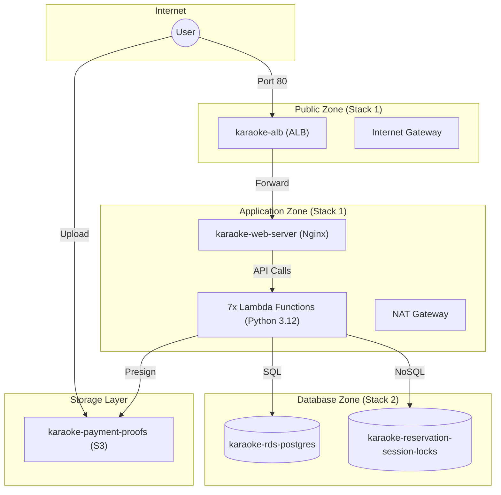

# Master Technical Specification: NeonStage Karaoke Reservation System

## 0. Infrastructure Topology (Visual)



## 1. Project Overview & Strategy

### 1.1. Operational Background
In the highly competitive landscape of 2026 entertainment services, the **NeonStage Karaoke Reservation System (KRS)** stands as a benchmark for cloud-native operational excellence. The system is engineered to solve the "Double-Booking Paradox" prevalent in legacy karaoke management systems. By leveraging a hybrid serverless architecture, KRS provides sub-second responsiveness for global users while maintaining strict transactional integrity at the database layer.

The architecture emphasizes **Operational Resilience**, **Granular Observability**, and **Controlled Scalability**. Each component is decoupled to ensure that a failure in one layer (e.g., the playback player) does not impact the core booking engine. This document serves as the single source of truth for the deployment, configuration, and maintenance of the KRS infrastructure.

### 1.2. Engineering Objectives
- **Transactional Consistency**: Using RDS PostgreSQL 15 for confirmed bookings and DynamoDB for atomic temporary locks.
- **Fault Isolation**: Implementing a 6-subnet VPC architecture to segregate traffic between public access, application logic, and isolated data.
- **Latency Optimization**: Utilizing AWS Lambda with Python 3.12 for event-driven execution with minimal cold-start impact.
- **Security by Design**: Enforcing HTTPS-only communication and strict IAM policies following the principle of least privilege.

### 1.3. Task List (Engineer Roadmap)

| Module | Task ID | Description | Requirement |
| :--- | :--- | :--- | :--- |
| **Network** | N.1 | Provision Dual-Stack VPC (IPv4 Only) | 6 Subnets, IGW, NAT |
| | N.2 | Configure Routing Tables | Public, Private, Isolated RTs |
| | N.3 | Create Security Group Matrix | Web, Lambda, RDS, ALB SGs |
| **Compute** | C.1 | Deploy Application Load Balancer | Internet-facing, Port 80 |
| | C.2 | Launch Web Server (AL2023) | EC2 with Project-Specific UserData |
| | C.3 | Configure Target Groups | Health Check on /health.html |
| **Data** | D.1 | Provision RDS PostgreSQL 15 | Multi-AZ, Isolated Subnets |
| | D.2 | Provision DynamoDB Locking Table | lock_id (PK) + TTL Support |
| | D.3 | Initialize DB Schema | Execution of init-db.sql |
| **Logic** | L.1 | Deploy Lambda Suite (7 Functions) | Python 3.12, VPC Attached |
| | L.2 | Configure Lambda Layer | psycopg2 & shared utilities |
| | L.3 | Setup Environment Variables | Tables per function |
| **API** | A.1 | Architect REST API | Amazon API Gateway |
| | A.2 | Configure CORS & Stages | Regional Endpoint, Prod Stage |
| **Storage** | S.1 | Provision Payment Bucket | S3 with CORS JSON |

---

## 2. Technical Standards & Environment

| Parameter | Value |
| :--- | :--- |
| **Region** | us-east-1 (N. Virginia) |
| **Resource Prefix** | `karaoke-` |
| **VPC CIDR** | 35.10.0.0/18 |
| **Lambda Runtime** | Python 3.12 |
| **DB Engine** | PostgreSQL 15 |
| **Web OS** | Amazon Linux 2023 |
| **Architecture** | 6-Subnet Hybrid Serverless |

The system uses a **Client-Side Dynamic Configuration** strategy. API Gateway endpoints and S3 Bucket names are managed directly via the frontend "Settings" modal (stored in LocalStorage) to ensure portability across different deployment stages without re-building the frontend.

---

## 3. Implementation: Networking & Infrastructure (Stack 1)

### 3.1. VPC Segmentation Detail
The network foundation is segmented into 3 security zones across 2 Availability Zones (us-east-1a and us-east-1b).

#### Public Zone (External Facing)
- **karaoke-public-1**: 35.10.0.0/25 (AZ-A)
- **karaoke-public-2**: 35.10.1.0/25 (AZ-B)
*Hosts: ALB, NAT Gateway.*

#### Private Zone (Application Layer)
- **karaoke-private-1**: 35.10.11.0/25 (AZ-A)
- **karaoke-private-2**: 35.10.12.0/25 (AZ-B)
*Hosts: EC2 Web Server, Lambda Functions.*

#### Isolated Zone (Data Layer)
- **karaoke-db-1**: 35.10.21.0/25 (AZ-A)
- **karaoke-db-2**: 35.10.22.0/25 (AZ-B)
*Hosts: RDS PostgreSQL.*

### 3.2. Security Group Matrix (Inbound Rules)
To ensure zero-trust security, the following security groups must be configured:

| Security Group Name | Port | Source | Description |
| :--- | :--- | :--- | :--- |
| **`karaoke-sg-alb`** | 80 | `0.0.0.0/0` | Public HTTP access to Load Balancer |
| **`karaoke-sg-web`** | 80 | `karaoke-sg-alb` | Restricts web traffic to ALB only |
| **`karaoke-sg-lambda`** | - | - | Egress-only for database/API access |
| **`karaoke-sg-rds`** | 5432 | `karaoke-sg-lambda` | DB access restricted to application logic |

### 3.3. Compute Layer: EC2 & ALB Specification

#### Application Load Balancer
- **Name**: `karaoke-alb`
- **Security Group**: `karaoke-sg-alb` (Allows Inbound 80 from 0.0.0.0/0)
- **Target Group**: `karaoke-tg-web` (Port 80, Health Check: `/health.html`)

#### Web Server (EC2)
- **Name**: `karaoke-web-server`
- **AMI**: Latest Amazon Linux 2023
- **Instance Type**: `t3.micro`
- **Security Group**: `karaoke-sg-web` (Allows Inbound 80 ONLY from `karaoke-sg-alb`)
- **Project-Specific User Data**:
```bash
#!/bin/bash
# 1. Update and Install Core Dependencies
dnf update -y
dnf install -y httpd git php

# 2. Start Web Server
systemctl start httpd
systemctl enable httpd

# 3. Setup Project Files
cd /var/www/html
# Clone project repository (Replace with actual repo URL if available)
git clone https://github.com/cc/karaoke-reservation.git .
# Move frontend files to root
cp -r frontend/* .
# Clean up
rm -rf frontend

# 4. Configure Permissions
chown -R apache:apache /var/www/html
chmod -R 755 /var/www/html

# 5. Create Health Check File
echo "NeonStage System Online" > /var/www/html/health.html
```

---

## 4. Implementation: Database Layer (Stack 2)

### 4.1. RDS PostgreSQL 15 (Stack 2)
- **DB Instance Identifier**: `karaoke-rds-postgres`
- **Database Name**: `karaokedb`
- **Master Username**: `dbadmin` (Default)
- **Master Password**: `SecurePass123!` (Default)
- **Engine**: PostgreSQL 15 (Free Tier compatible: `db.t3.micro`)
- **Storage**: 20GB gp2
- **Security Group**: `karaoke-sg-rds` (Inbound 5432 ONLY from `karaoke-sg-lambda`)
- **DB Subnet Group Name**: `karaoke-db-subnet-group`
- **DB Subnet Group Subnets**: Must be created using the **Isolated Zone** subnets (`karaoke-db-1` and `karaoke-db-2`). 
  > [!IMPORTANT]
  > Do NOT use the VPC public or private subnets for the RDS Subnet Group. Use only the subnets designated for the Data Zone.

### 4.2. DynamoDB Atomic Locking
- **Table Name**: `karaoke-reservation-session-locks`
- **Region**: `us-east-1`
- **Billing Mode**: `On-Demand (PAY_PER_REQUEST)`
- **PK**: `lock_id` (String)
- **TTL Attribute**: `expires_at` (Number/Epoch)

---

## 5. Backend Logic (AWS Lambda) - Python 3.12

### 5.1. Global Lambda Configuration
| Parameter | Value |
| :--- | :--- |
| **Runtime** | Python 3.12 |
| **Layer Name** | `karaoke-layer` |
| **VPC Config** | Attach to `karaoke-private-1` & `karaoke-private-2` |

### 5.2. Function Configuration Matrix

| Function Name | Memory | Timeout | Environment Variables |
| :--- | :--- | :--- | :--- |
| `karaoke-rooms` | 128 MB | 15s | `DB_HOST`, `DB_NAME`, `DB_USER`, `DB_PASS` |
| `karaoke-booking` | 256 MB | 30s | `DB_HOST`, `DYNAMODB_TABLE` |
| `karaoke-status` | 128 MB | 20s | `DB_HOST`, `DYNAMODB_TABLE` |
| `karaoke-confirm` | 128 MB | 30s | `DB_HOST`, `S3_BUCKET`, `DYNAMODB_TABLE` |
| `karaoke-presign` | 128 MB | 10s | `S3_BUCKET` |
| `karaoke-check-slot` | 128 MB | 15s | `DB_HOST`, `DYNAMODB_TABLE` |

---


## 6. API Gateway Interface
- **API Name**: `karaoke-api`
- **Protocol**: REST API
- **Endpoint Type**: Regional
- **Deployment Stage**: `prod`

### 6.1. Endpoint Documentation
| Resource | Method | Lambda Integration | Logic Description |
| :--- | :--- | :--- | :--- |
| `/rooms` | GET | `karaoke-rooms` | Reads active rooms from RDS |
| `/booking` | POST | `karaoke-booking` | Performs Atomic Lock & Pending Insert |
| `/status` | GET | `karaoke-status` | Aggregates RDS and DDB sessions |
| `/check-slot` | GET | `karaoke-check-slot` | Real-time availability verification |
| `/confirm` | POST | `karaoke-confirm` | Verifies payment and finalizes reservation |
| `/presign` | POST | `karaoke-presign` | Generates secure upload URL for receipts |

---

## 7. Storage & Security

### 7.1. S3 Payment Proof Bucket
- **Bucket Name**: `karaoke-payment-proofs-[name]` (e.g., `karaoke-payment-proofs-cc-2026`)
- **Region**: `us-east-1`

**CORS Policy (Copy-Paste JSON):**
```json
[
  {
    "AllowedHeaders": ["*"],
    "AllowedMethods": ["GET", "PUT", "POST", "HEAD"],
    "AllowedOrigins": ["*"],
    "ExposeHeaders": ["ETag", "x-amz-request-id", "x-amz-id-2"],
    "MaxAgeSeconds": 3000
  }
]
```

---

## 8. Deployment Orchestration (CloudFormation)

The infrastructure is split into two logical stacks to ensure modularity and clean dependency management.

### Step 1: Deploy Stack 1 (Core Infrastructure)
- **Template**: `cloudformation/01-vpc-ec2-alb.yaml`
- **Stack Name**: `karaoke-stack-1`
- **What it creates**: VPC, 6 Subnets, NAT Gateway, ALB, and EC2 Web Server.
- **Instructions**: 
  1. Upload the template to AWS CloudFormation.
  2. Wait for the status `CREATE_COMPLETE`.

### Step 2: Deploy Stack 2 (Database Layer)
- **Template**: `cloudformation/02-database-layer.yaml`
- **Stack Name**: `karaoke-stack-2`
- **What it creates**: RDS PostgreSQL Instance, RDS Subnet Group, and DynamoDB Table.
- **Instructions**:
  1. Ensure Stack 1 is fully deployed (it exports the required Subnet IDs).
  2. Wait for `CREATE_COMPLETE`.

### Step 3: Application Logic (Manual/CLI)
1. **Lambda Layer**: 
   - Prepare `layer.zip` containing `psycopg2` and utilities (see `lambda/README.md`).
   - Create a Lambda Layer named `karaoke-layer` and upload the zip.
2. **Lambda Functions**: 
   - Deploy the 6 functions in the `lambda/` directory.
   - Attach them to the Private Subnets of the VPC.
   - Assign the `karaoke-lambda-sg` security group.
   - Set the required Environment Variables as specified in Section 5.2.

---

© 2026 NeonStage System - All Technical Specifications Finalized.
